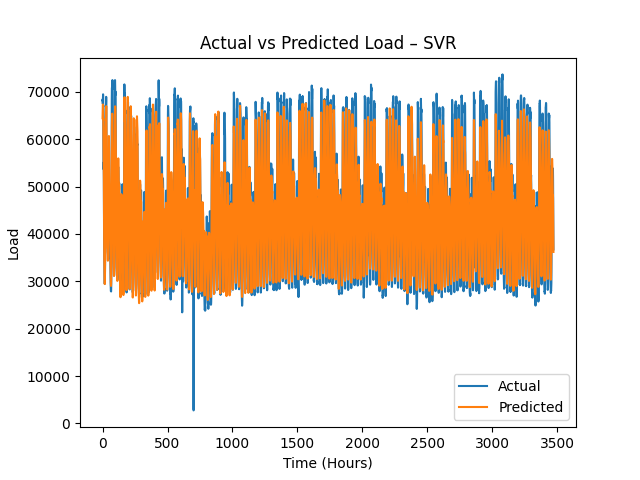
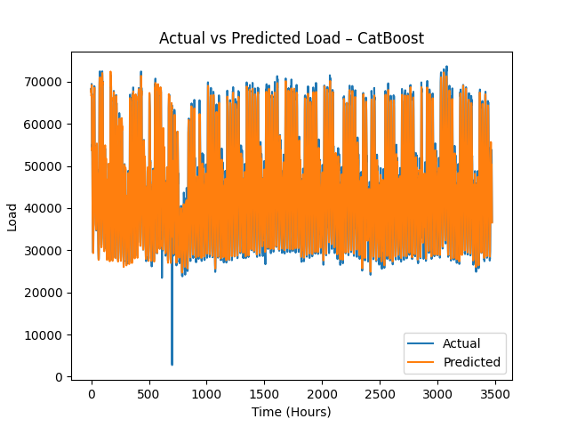

# Short-Term Load Forecasting using Machine Learning

## Overview

Short-Term Load Forecasting (STLF) predicts electricity demand for the next few hours up to 24 hours ahead. Accurate forecasting helps power utilities efficiently schedule electricity generation, manage energy distribution, reduce operational costs, and maintain grid stability.

Electricity demand varies due to several factors such as:

- Temperature
- Time of day
- Seasonal patterns
- Human activity

Traditional statistical models often struggle to capture these nonlinear patterns. In this project, multiple **machine learning models** are implemented and compared to improve the accuracy of short-term electricity load forecasting.

---

# Table of Contents

- Overview
- Problem Statement
- Dataset Information
- Methodology
- Exploratory Data Analysis
- Data Preprocessing
- Machine Learning Models
- Evaluation Metrics
- Results
- Observations
- Project Structure
- Installation
- Usage
- Future Improvements
- References

---

# Problem Statement

Electricity load fluctuates continuously due to dynamic factors such as weather, time of day, and human behavior. Traditional forecasting approaches like ARIMA and linear regression often fail to capture complex nonlinear dependencies in the data.

This project aims to build and compare machine learning models capable of learning these complex relationships and producing accurate short-term electricity load forecasts.

---

# Dataset Information

The dataset used in this project was obtained from **Mendeley Data** and contains hourly electricity load measurements.

## Dataset Characteristics

- Hourly electricity demand values
- Timestamp-based time series
- Temperature data as an external variable
- Continuous time coverage
- Suitable for time-series forecasting

## Key Variables

| Feature | Description |
|-------|-------------|
| Timestamp | Date and time of measurement |
| Load | Electricity demand |
| Temperature | Weather temperature |

The dataset enables analysis of **daily patterns, weekly seasonality, and weather impact on load demand**.

---

# Methodology

The project follows a structured machine learning pipeline:

1. Data Understanding
2. Exploratory Data Analysis
3. Feature Engineering
4. Data Preprocessing
5. Model Development
6. Model Evaluation
7. Performance Comparison

---

# Exploratory Data Analysis (EDA)

EDA was conducted to understand the underlying patterns and dependencies in the dataset.

### Load vs Time
- Shows overall trend and seasonality.

### Load Distribution
- Analyzes the statistical spread of load values.

### Average Load by Hour
- Identifies peak and off-peak electricity consumption hours.

### Average Load by Day of Week
- Highlights differences between weekday and weekend consumption.

### Load vs Temperature
- Examines the relationship between weather and electricity demand.

### Current Load vs Previous Hour Load
- Demonstrates strong temporal dependency in electricity demand.

### Autocorrelation Analysis
- Shows correlation across time lags.

### Correlation Heatmap
- Displays relationships between load, temperature, and time features.

These insights guided the **feature engineering(preprocessing) process**.

---

# Data Preprocessing Pipeline

Raw time-series data cannot be directly used for machine learning models. An **8-step preprocessing pipeline** was implemented.

## 1. Data Loading & Timestamp Processing

- Load dataset from CSV
- Convert timestamp to datetime format
- Sort data chronologically

Purpose:

- Preserve temporal order
- Prevent data leakage

---

## 2. Time-Based Feature Extraction

Extracted features:

- Hour of day
- Day of week
- Day of month
- Month
- Weekend indicator

Purpose:

- Capture periodic demand patterns.

---

## 3. Lag Feature Generation

Historical load values were added as features.

Load lags:

- 1 hour
- 2 hours
- 3 hours
- 24 hours
- 48 hours
- 168 hours

Temperature lags:

- 1 hour
- 24 hours

Purpose:

- Provide historical context for machine learning models.

---

## 4. Rolling Statistical Features

Rolling statistics capture short-term trends.

Features:

- Rolling mean (3h, 6h, 24h)
- Rolling standard deviation (24h)

Purpose:

- Smooth fluctuations
- Capture demand volatility

---

## 5. Cyclical Encoding

Time features were encoded using **sine and cosine transformations**.

Applied to:

- Hour of day
- Day of week

Purpose:

- Preserve cyclic nature of time.

---

## 6. Data Cleaning

- Lag and rolling operations introduce missing values.
- Rows containing NaN values were removed.

---

## 7. Time-Aware Train-Test Split

Dataset split:

- 80% Training Data
- 20% Testing Data

Chronological splitting ensures realistic forecasting.

---

## 8. Feature Scaling

- Standardization applied only for SVR
- Tree-based models do not require scaling

---

# Machine Learning Models

Four machine learning algorithms were implemented.

---

## Random Forest Regressor

Random Forest is an ensemble learning method that builds multiple decision trees and combines their predictions.

Key advantages:

- Reduces overfitting
- Handles nonlinear relationships
- Provides stable predictions

---

## Support Vector Regression (SVR)

SVR is a kernel-based regression technique that attempts to fit data within a specified error margin.

Key characteristics:

- Margin-based regression
- Uses kernel functions (RBF, polynomial)
- Effective for high-dimensional data

---

## XGBoost

XGBoost (Extreme Gradient Boosting) is an optimized gradient boosting algorithm designed for high performance.

Key features:

- Gradient boosting framework
- Regularization to prevent overfitting
- Parallel processing
- Efficient tree pruning

---

## CatBoost

CatBoost is a gradient boosting algorithm optimized for handling categorical features.

Key advantages:

- Native categorical handling
- Ordered boosting to reduce bias
- Symmetric tree structure

---

# Evaluation Metrics

Several regression metrics were used to evaluate model performance.

## RMSE (Root Mean Square Error)

Measures square root of average squared prediction errors.

Higher penalty for large errors.

---

## MAE (Mean Absolute Error)

Average absolute difference between predicted and actual values.

---

## MAPE (Mean Absolute Percentage Error)

Measures error relative to actual values in percentage form.

---

## sMAPE (Symmetric Mean Absolute Percentage Error)

Improved version of MAPE that reduces bias.

---

## R² Score

Measures how well the model explains variance in the data.

Range:

```
0 = poor model
1 = perfect prediction
```

---

## MBE (Mean Bias Error)

Indicates systematic prediction bias.

- Positive → Underprediction
- Negative → Overprediction

---

# Results


## Model Predictions

### XGBoost – Actual vs Predicted


### Random Forest – Actual vs Predicted


### SVR – Actual vs Predicted



### CatBoost – Actual vs Predicted



| Model | RMSE | MAE | MAPE | sMAPE | R² | MBE |
|------|------|------|------|------|------|------|
| Random Forest | 2019 | 1093 | 3.02% | 2.43% | 0.979 | +413 |
| SVR | 4212 | 3048 | 7.77% | 6.79% | 0.909 | +530 |
| XGBoost | **1927** | 1205 | 3.23% | 2.73% | **0.981** | +334 |
| CatBoost | 2262 | 1448 | 4.04% | 3.35% | 0.974 | +284 |

---

# Observations

Key findings:

- **XGBoost achieved the best performance** with lowest RMSE and highest R².
- Random Forest performed nearly as well as XGBoost.
- SVR showed the weakest performance.
- All tree-based models achieved **R² greater than 0.97**, indicating strong prediction capability.

Conclusion:

**XGBoost is the most effective model for this short-term load forecasting dataset.**

---


# Future Improvements

Potential improvements for this project:

- Deep learning models (LSTM, GRU)
- Transformer-based time-series forecasting
- Additional weather variables (humidity, wind speed)
- Probabilistic load forecasting
- Real-time load forecasting system

---

# References

1. Zhang, L., & Jánošík, D. (2024). Enhanced short-term load forecasting with hybrid machine learning models.
2. Lahouar, A., & Slama, J. (2015). Day-ahead load forecast using Random Forest.
3. Chen, Y. et al. (2017). Short-term electrical load forecasting using SVR.
4. Yang, Q. et al. (2024). Short-term load forecasting using XGBoost and transfer learning.
5. Akhtar, S., & Shahzad, S. (2023). Short-Term Load Forecasting Models: Review of Challenges and Progress.

---

If you found this project useful, consider giving it a star on GitHub, Thank You!!